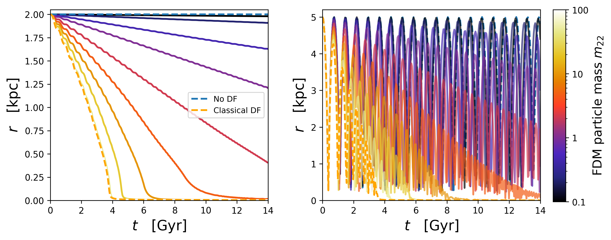

# Fuzzy Dark Matter (FDM) Dynamical Friction

  

## Dynamical friction in FDM universe

`FDMDynamicalFrictionForce` is a new class of the package [galpy](https://www.galpy.org/), used to perform orbit integration of point masses that undergo dynamical friction in galactic potentials, assuming a FDM dynamical friction. This is subclass is derived from the classical dynamical friction class [`ChandrasekharDynamicalFrictionForce`](https://docs.galpy.org/en/v1.10.1/reference/potentialchandrasekhardynfric.html). Informations about the implementation of the `FDMDynamicalFrictionForce` class and simple example can be found in the [`galpy` documentation](https://docs.galpy.org/en/latest/reference/potentialfdmdynfric.html).

FDM model leads to significant modifications of the dark matter propreties on galactic scales. One of the distinctive dynamical features consist on a reduction or even a suppression of dynamical friction compared to the CDM case. We have implemented the theoretical work carried out by [Lancaster et al. +19](https://arxiv.org/abs/1909.06381). See [Szpilfidel et al. +25]() for more a detailed description of the implementation.

### Usage
This repository contains : 
* `infallingGCs.ipynb`, a Jupyter notebook that generate number of GCs in a dark matter halo and calculate their infall time as a function of their initial energy-angular momentum state. (Runtime : 0.2 CPU hours).
* `DFefficiency.ipynb`, a Jupyter notebook that draws a map of the efficiency of dynamical friction as a function of the halo-GC mass ratio and the mass of the FDM constituent particle. (Runtime : 1.34 CPU hours).

Note : before running the notebooks, make sure you have installed the Python packages `galpy` and `colossus`.

## Authors
`FDMDynamicalFrictionForce` is distributed under the MIT license. See [MIT License](https://en.wikipedia.org/wiki/MIT_License) for more details. If you use `FDMDynamicalFrictionForce` in a publication, please cite the code paper [Szpilfidel et al. +25]() and the `galpy` paper [Bovy +15](https://arxiv.org/abs/1412.3451).

* [Adrian Szpilfidel](mailto:adrian.szpilfidel@obspm.fr) -- LIRA, Observatoire de Paris, France
* [Pierre Boldrini](mailto:pierre.boldrini@obspm.fr) -- LIRA, Observatoire de Paris, France
* [Jo Bovy](mailto:boldrini@iap.fr) -- University of Toronto, Canada
